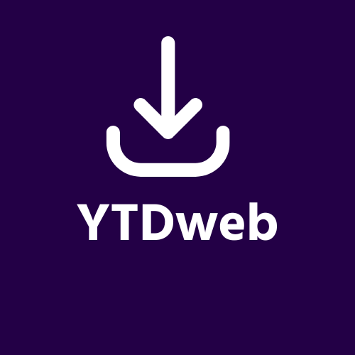

# YTDweb

Este é um simples aplicativo web construído com Node.js que permite aos usuários baixar vídeos do YouTube. Ele oferece uma interface fácil de usar na qual os usuários podem inserir a URL do vídeo do YouTube que desejam baixar e clicar em um botão para iniciar o processo de download.

## Recursos

- Campo de entrada para inserir a URL do vídeo do YouTube.
- Botão de download para iniciar o processo de download.
- Suporta o download de vídeos em vários formatos e qualidades.

## Instalação

1. Clone o repositório: `git clone https://github.com/DsK-David/YTDweb`
2. Navegue até o diretório do projeto: `cd YTDweb`
3. Instale as dependências: `npm install`

## Uso

1. Inicie o servidor: `npm start`
2. Abra o navegador da web e acesse: `http://localhost:3000`
3. Insira a URL do vídeo do YouTube que deseja baixar no campo de entrada.
4. Clique no botão "Baixar" para iniciar o processo de download.

## Tecnologias Utilizadas

- Node.js: Servidor backend para lidar com as solicitações de download e servir a aplicação web.
- Express.js: Framework de aplicação web usado para criar rotas e lidar com solicitações HTTP.
- [font-awesome](https://fontawesome.com/): Usado para o ícone de download.

## Licença

Este projeto está licenciado sob a Licença MIT - consulte o arquivo [LICENSE](LICENSE) para obter detalhes.

## Reconhecimentos

- [Font Awesome](https://fontawesome.com/) pelo ícone de download.

## Contribuição

Contribuições são bem-vindas! Se encontrar algum problema ou quiser adicionar novos recursos, sinta-se à vontade para criar uma solicitação pull ou abrir uma issue. Por favor, siga o código de conduta do projeto.

